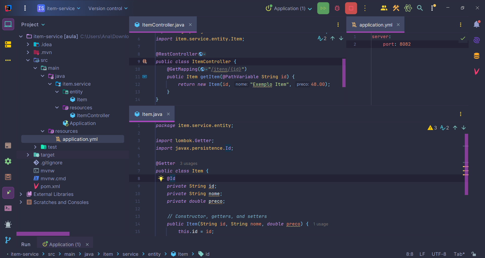
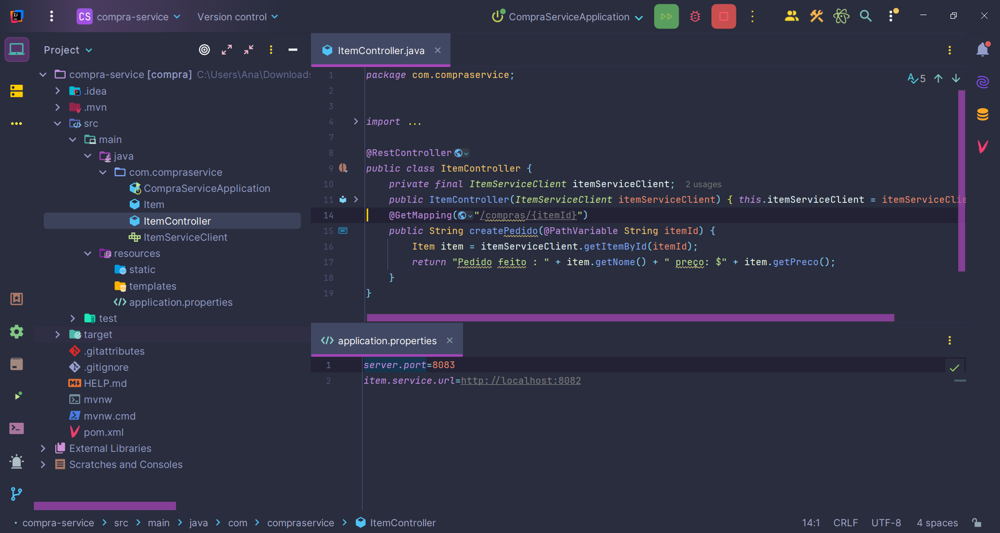
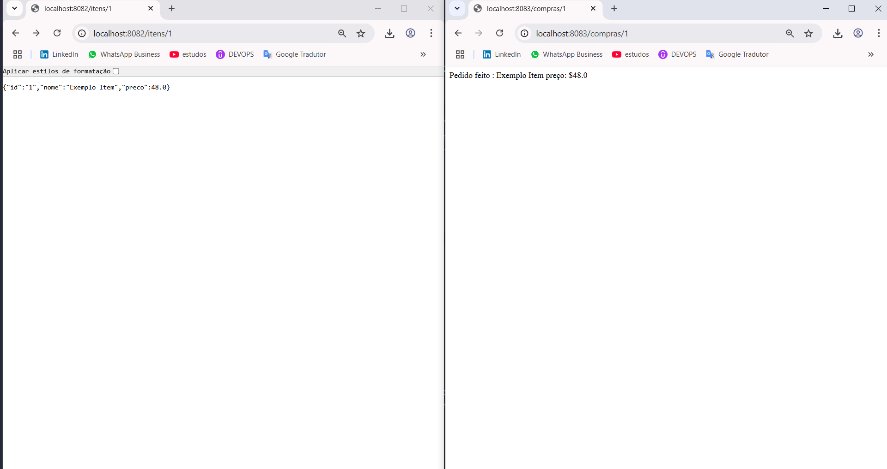

## 1.1 Microservices

https://spring.io/projects/spring-cloud-openfeign

### Read more

- https://www.alura.com.br/curso-online-microsservicos-implementando-java-spring
- https://cursos.alura.com.br/forum/topico-acesso-a-uma-api-utilizando-o-feign-152093
- https://cursos.alura.com.br/forum/topico-qual-a-diferenca-entra-rest-template-e-o-feign-171687
- https://www.amazon.com/Microservices-Spring-Boot-Cloud-microservices-ebook/
- https://learn.microsoft.com/pt-br/azure/developer/java/spring-framework/

##### 1.2 Spring Security Content:

- https://spring.io/projects/spring-security

This study will not deploy sites in production, as it is intended for local study.

> [!NOTE]
>
> Study without political purposes.
